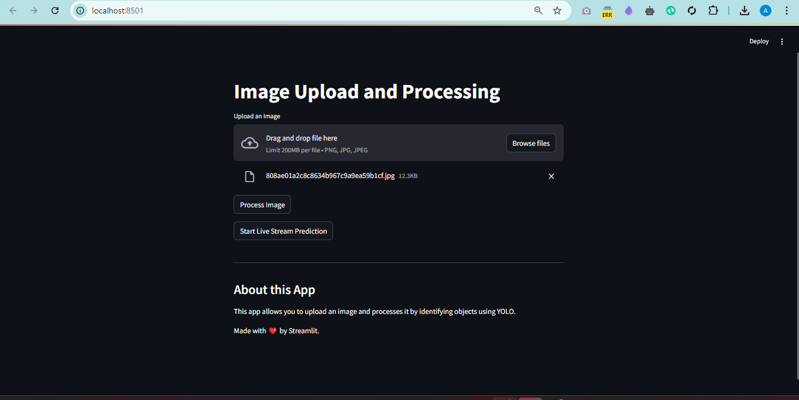
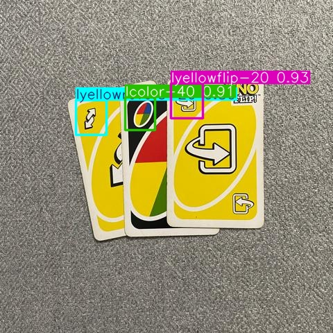
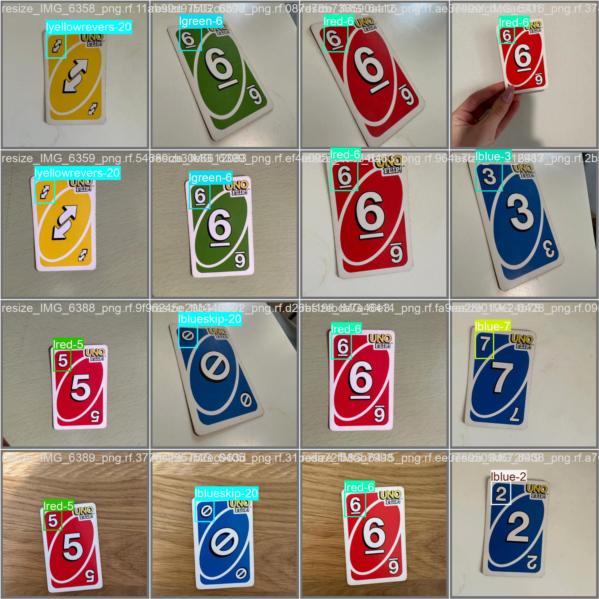

# UnoCardDetection - Real-Time Card Detection with OpenCV

## Overview

**UnoCardDetection** is a real-time card detection system designed using OpenCV for image processing. This project allows you to detect cards (with color and number recognition) using a webcam, based on a trained machine learning model. The system uses an annotated dataset for training and relies on computer vision techniques for live detection and tracking. 

## Features

- **Annotated Dataset**: The model is trained on an annotated dataset of cards, where each card is labeled with its number and color.
- **Real-Time Detection**: The system uses your webcam to detect cards in real-time, identifying both the card's number and color.
- **Uploaded image Detection**: The system also includes a function which enables users to upload images for detection instead of live streamed images.
- **OpenCV Integration**: OpenCV is used for processing live video streams from the webcam, preprocessing images, and detecting card features.

---

## Table of Contents
- [Getting Started](#getting-started)
- [Testing](#Testing)
- [Real-Time Detection](#real-time-detection)
- [Installation](#installation)
- [Usage](#usage)
- [Contributing](#contributing)
- [License](#license)

---

## Getting Started

To get started with the UnoCardDetection system, follow the steps to install dependencies, prepare the dataset, train the model, and perform real-time detection using a webcam.

## Testing

This model has been rigorously tested, the testing files can be viewed. The images below show the testing of the final model.


### Prerequisites

Before you begin, ensure you have the following installed on your machine:

- Python 3.8+
- OpenCV
- TensorFlow or PyTorch (depending on the model you choose)
- LabelImg (for data annotation)
- Webcam (for real-time detection)

---


### What is an Annotated Dataset?

An annotated dataset is a collection of images where each image is labeled with the specific information the model needs to learn, such as the number and color of the card. Each card in the dataset is labeled with bounding boxes and classifications (e.g., "Card 2, Red").

### Why We Need Annotation?

Data annotation allows the model to understand and classify visual features like shapes, colors, and numbers. In this case, the annotations will teach the model to recognize cards based on these features during training.

### How to Create an Annotated Dataset?

You can use tools like **LabelImg** to annotate images by drawing bounding boxes around the cards and assigning the correct label (number and color). The annotations are then saved in XML or CSV formats that are compatible with TensorFlow or PyTorch.

---


### Choosing a Model

For card detection, you can use object detection models such as:

- **YOLO (You Only Look Once)**: A fast and accurate object detection model suitable for real-time applications.
- **Faster R-CNN**: A more precise, though slightly slower, object detection model that may offer better accuracy in certain cases.

### Training the Model

1. **Preprocessing**: The annotated dataset is fed into the model for training. OpenCV can be used to preprocess the images (resizing, normalization, etc.) before training.
2. **Training**: Use your preferred deep learning framework (TensorFlow or PyTorch) to train the model. Ensure that the model is optimized for detecting the specific number and color of the cards.
3. **Evaluation**: Once trained, evaluate the model's performance on a validation dataset to ensure it can generalize well.

---

## Real-Time Detection

Once the model is trained, the next step is real-time detection using OpenCV and a live webcam feed.

### How It Works

1. **Capture Webcam Feed**: OpenCV is used to access the webcam and capture live video frames.
2. **Card Detection**: Each frame is processed in real-time by the trained model. The model identifies the cards' number and color, drawing bounding boxes and labels around the detected cards.
3. **Display Results**: The detected cards are shown on the screen with the identified number and color, providing real-time feedback.

## Installation

1. **Clone the Repository**:
   ```bash
   git clone https://github.com/Stormynova/Uno_Card_detection_System.git
   cd UnoCardDetection
   ```

2. **Install Dependencies**:
   ```bash
   pip install -r requirements.txt
   ```

3. **Run Real-Time Detection**:
   ```bash
   run the runner.bat file
   ```






---

## Usage

1. Upload an image of an Uno card, the system works best with images with a clear or plain background, it still works with images with a complicated background, but with lower success.
2. for the image uploder, the images should be taken at a medium distance from the card, about 45 cm 
   

## Live Testing

link : https://youtu.be/GueZnZKbhPA
---

## Contributing

If you'd like to contribute to UnoCardDetection, feel free to submit pull requests or open issues. Contributions to improve the model or add more features are always welcome.

---

## License

This project is licensed under the MIT License.
