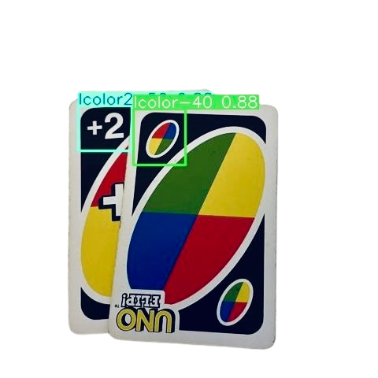
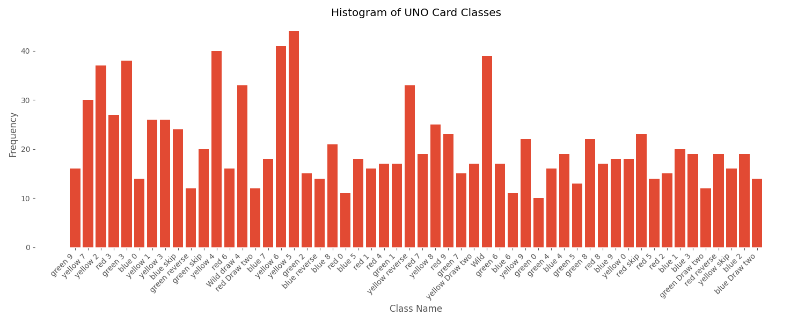
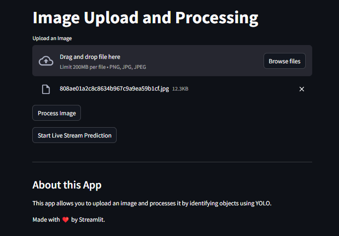

[](https://opensource.org/licenses/MIT)
[](https://www.python.org/downloads/)
[](https://opencv.org/)
[](https://streamlit.io/)
[](https://github.com/ultralytics/ultralytics)

[](https://uno-detector.streamlit.app/)


<div align="center" style="display: flex; align-items: center; justify-content: center; gap: 20px;">
<h1>UnoCardDetection - Real-Time Card Detection using YOLOv8 and OpenCV</h1>

</div>

## Overview
**UnoCardDetection** is a computer vision project that uses YOLOv8 and OpenCV to detect and classify UNO cards in real-time. The system can identify all standard UNO cards including numbers (0-9), action cards (Skip, Reverse, Draw Two), and wild cards through either a webcam feed or uploaded images. Built with a custom-trained YOLOv8 model on an extensively annotated dataset, it provides accurate card detection and classification even in varying lighting conditions and card orientations.

## Features

- **Annotated Dataset**: The model is trained on an annotated dataset of cards, where each card is labeled with its number and color.
- **Real-Time Detection**: The system uses your webcam to detect cards in real-time, identifying both the card's number and color.
- **Uploaded image Detection**: The system also includes a function which enables users to upload images for detection instead of live streamed images.
- **OpenCV Integration**: OpenCV is used for processing live video streams from the webcam, preprocessing images, and detecting card features.
- **Streamlit**: The project is built using Streamlit, a live web app is provided for testing the model.

---

## Table of Contents
- [Overview](#overview)
- [Features](#features)
- [Table of Contents](#table-of-contents)
- [Getting Started](#getting-started)
- [Testing](#testing)
  - [Dataset Testing](#dataset-testing)
  - [What is an Annotated Dataset?](#what-is-an-annotated-dataset)
  - [Why We Need Annotation?](#why-we-need-annotation)
  - [How to Create an Annotated Dataset?](#how-to-create-an-annotated-dataset)
  - [Choosing a Model](#choosing-a-model)
  - [Training the Model](#training-the-model)
- [Real-Time Detection](#real-time-detection)
  - [How It Works](#how-it-works)
- [Installation](#installation)
  - [Prerequisites](#prerequisites)
- [Usage](#usage)
- [Live Testing](#live-testing)
- [Contributing](#contributing)
- [License](#license)

---

## Getting Started

To get started with the UnoCardDetection system, follow the steps to install dependencies, prepare the dataset, train the model, and perform real-time detection using a webcam.

## Testing

### Dataset Testing
Follow the links below to view the testing results of the model on the dataset.
1. [](./UNO-DATASET--2/README.md)
2. [](./UNO-DATASET--3/README.md)

This model has been rigorously tested, the testing files can be viewed. The images below show the testing of the final model.

<!--  -->
<!-- The above image shows the histogram of the dataset (UNO-DATASET--3) that we used to train the model. -->

<!--  -->


---

### What is an Annotated Dataset?

An annotated dataset is a collection of images where each image is labeled with the specific information the model needs to learn, such as the number and color of the card. Each card in the dataset is labeled with bounding boxes and classifications (e.g., "Card 2, Red").

### Why We Need Annotation?

Data annotation allows the model to understand and classify visual features like shapes, colors, and numbers. In this case, the annotations will teach the model to recognize cards based on these features during training.

### How to Create an Annotated Dataset?

You can use tools like **LabelImg** to annotate images by drawing bounding boxes around the cards and assigning the correct label (number and color). The annotations are then saved in XML or CSV formats that are compatible with TensorFlow or PyTorch.

---


### Choosing a Model

For card detection, you can use object detection models such as:

- **YOLO (You Only Look Once)**: A fast and accurate object detection model suitable for real-time applications.
- **Faster R-CNN**: A more precise, though slightly slower, object detection model that may offer better accuracy in certain cases.

### Training the Model

1. **Preprocessing**: The annotated dataset is fed into the model for training. OpenCV can be used to preprocess the images (resizing, normalization, etc.) before training.
2. **Training**: Use your preferred deep learning framework (TensorFlow or PyTorch) to train the model. Ensure that the model is optimized for detecting the specific number and color of the cards.
3. **Evaluation**: Once trained, evaluate the model's performance on a validation dataset to ensure it can generalize well.

---

## Real-Time Detection

Once the model is trained, the next step is real-time detection using OpenCV and a live webcam feed.

### How It Works

1. **Capture Webcam Feed**: OpenCV is used to access the webcam and capture live video frames.
2. **Card Detection**: Each frame is processed in real-time by the trained model. The model identifies the cards' number and color, drawing bounding boxes and labels around the detected cards.
3. **Display Results**: The detected cards are shown on the screen with the identified number and color, providing real-time feedback.

## Installation


### Prerequisites

Before you begin, ensure you have the following installed on your machine:

- Python 3.8+
- OpenCV # For image processing
- Ultralytics # For model training
- Roboflow # For dataset annotation
- Matplotlib # For visualization

Installing python, pip, and virtual environment:

For Linux (Ubuntu, Debian, etc.):
```bash
# install pip
sudo apt-get install python3-pip
# install venv
sudo apt-get install python3-venv
# create virtual environment
python3 -m venv uno-env
# activate virtual environment
source uno-env/bin/activate
```

For MacOS:
```bash
# create virtual environment
python3 -m venv uno-env
# activate virtual environment
source uno-env/bin/activate
```

For Windows:
```bash
# create virtual environment
python -m venv uno-env
# activate virtual environment
uno-env\Scripts\activate
```

Now,
1. **Clone the Repository**:
   ```bash
   git clone https://github.com/Stormynova/Uno_Card_detection.git
   cd Uno_Card_detection
   ```

2. **Install Dependencies**:
   ```bash
   pip install -r requirements.txt
   ```

3. **Run the Application**:

   For real-time webcam detection:
   ```bash
   python live_camera_test.py
   ```

   For testing on a single image:
   ```bash
   python single_image_test.py --image path/to/your/image.jpg
   ```

   For the web application:
   ```bash
   chmod +x runner.bat
   ./runner.bat
   ```
   Open http://localhost:8501/ in your browser to view the web app.

## Usage

1. Upload an image of an Uno card, the system works best with images with a clear or plain background, it still works with images with a complicated background, but with lower success.
2. For the image uploder, the images should be taken at a medium distance from the card, about 45 cm 
   


<!-- predict image -->


---


## Live Testing

Click to view the live testing video on Youtube:
<!-- add gif link -->
<a href="https://youtu.be/GueZnZKbhPA">

</a>

### 0. Data Analysis
#### Histograms of the datasets


#### Comparison of detection rates across different datasets:
- Mean Detection Confidence: Shows the average confidence scores with error bars for each dataset
- Average Detections per Image: Displays the mean number of cards detected in each image
- Class Distribution: Plots the distribution of detected card classes across datasets
- Total Cards Detected: Compares the total number of cards detected in each dataset


---
#### Definitions:
- **Confusion Matrix**: Shows how well the model classifies each UNO card type in dark conditions. The rows represent the true labels and columns represent predicted labels. Brighter colors indicate more predictions in that cell. Perfect classification would show a bright diagonal line.
- **Performance Curves**: Three key performance metrics are shown:
  - F1 Score vs Confidence Threshold: Shows how the F1 score (balance of precision and recall) changes with different confidence thresholds. The red dot marks the optimal threshold.
  - Precision vs Recall: Illustrates the tradeoff between precision (accuracy of positive predictions) and recall (ability to find all positive cases). The red dot indicates maximum precision point.
  - Recall vs Confidence Threshold: Demonstrates how recall changes with different confidence thresholds. The red dot shows the threshold with highest recall.

---
### 1. Dark Background
These images were taken in a dark room and tests the model's ability to detect cards in low-light conditions.


---
### 2. Plain Background
These images were taken in a plain background and tests the model's ability to detect cards in a simple background.


---
### 3. Non-Plain Background
These images were taken in a non-plain background and tests the model's ability to detect cards in a non-simple background. 


---

## Contributing

Please refer to the [CONTRIBUTING.md](CONTRIBUTING.md) file for guidelines on how to contribute to this project.

---

## License

Please refer to the [LICENSE](LICENSE) file for more information.
