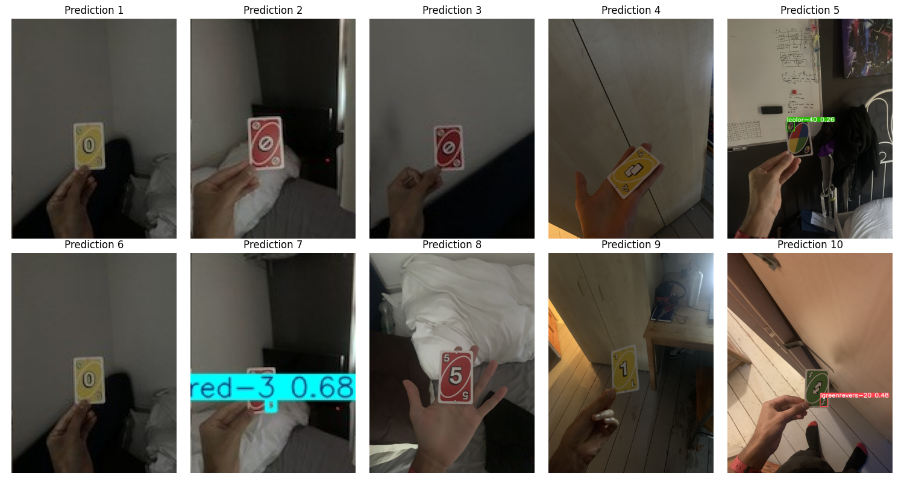

## UNO-DATASET--2: Dynamic Scenes

### 0. Data Analysis
#### Histograms of the datasets

#### Comparison of detection rates across different datasets:
- Mean Detection Confidence: Shows the average confidence scores with error bars for each dataset
- Average Detections per Image: Displays the mean number of cards detected in each image
- Class Distribution: Plots the distribution of detected card classes across datasets
- Total Cards Detected: Compares the total number of cards detected in each dataset

---
#### Definitions:
- **Confusion Matrix**: Shows how well the model classifies each UNO card type in dark conditions. The rows represent the true labels and columns represent predicted labels. Brighter colors indicate more predictions in that cell. Perfect classification would show a bright diagonal line.
- **Performance Curves**: Three key performance metrics are shown:
  - F1 Score vs Confidence Threshold: Shows how the F1 score (balance of precision and recall) changes with different confidence thresholds. The red dot marks the optimal threshold.
  - Precision vs Recall: Illustrates the tradeoff between precision (accuracy of positive predictions) and recall (ability to find all positive cases). The red dot indicates maximum precision point.
  - Recall vs Confidence Threshold: Demonstrates how recall changes with different confidence thresholds. The red dot shows the threshold with highest recall.

---
### 1. Dark Background
These images were taken in a dark room and tests the model's ability to detect cards in low-light conditions.

---
### 2. Plain Background
These images were taken in a plain background and tests the model's ability to detect cards in a simple background.

---
### 3. Non-Plain Background
These images were taken in a non-plain background and tests the model's ability to detect cards in a non-simple background. 

---
### 4. Tilted Images
These images were taken with a tilted camera and tests the model's ability to detect cards in a tilted image.

