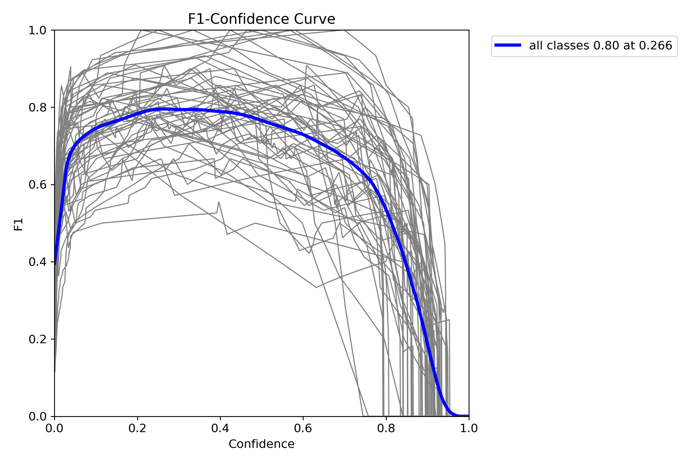

# Model Performance Visualization on UNO-DATASET--3

## Predictions

## Confusion Matrices
The confusion matrix shows how well our model classifies each type of UNO card. The brighter squares along the diagonal indicate accurate predictions.

The normalized confusion matrix provides the same information but as percentages, making it easier to interpret the model's performance across classes.

## Performance Metrics

The F1 curve shows the balance between precision and recall across different confidence thresholds. Higher curves indicate better overall performance.

The Precision-Recall curve demonstrates the trade-off between precision and recall. The closer the curve is to the top-right corner, the better the model performs.

The Recall curve shows how well the model identifies positive cases at different confidence thresholds. A higher curve indicates better recall performance.
